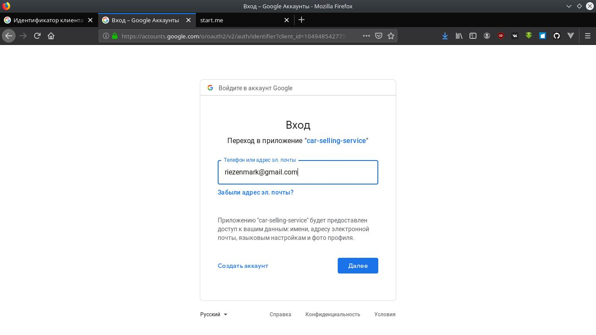
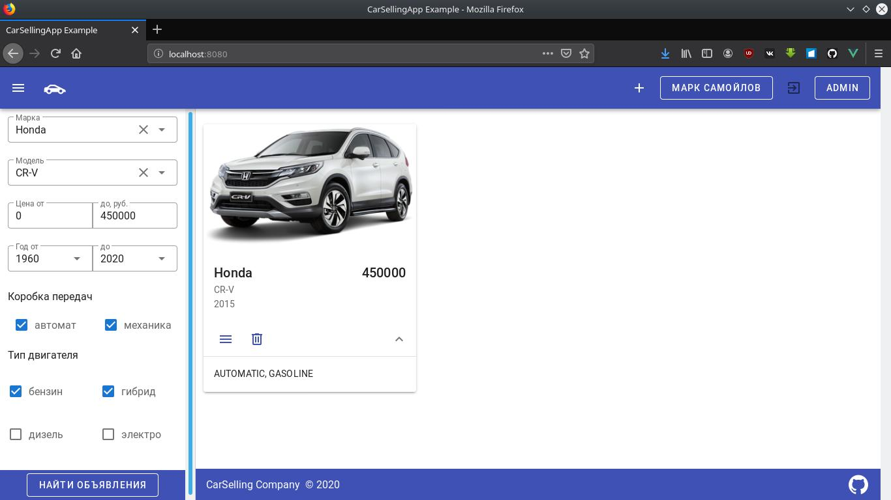
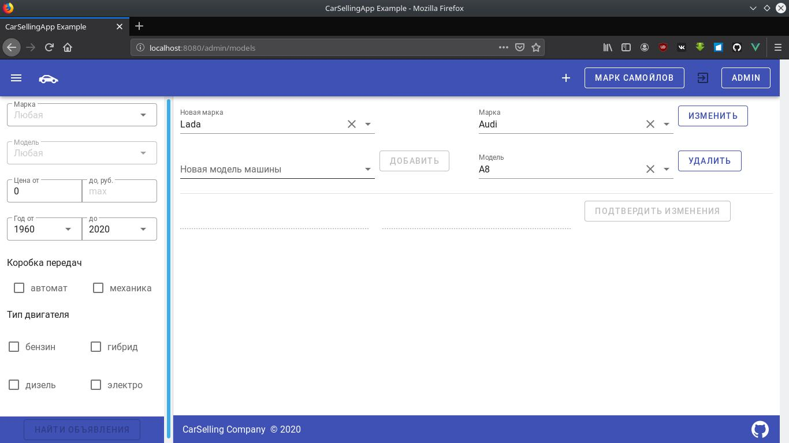

# Car Selling Service Example App

Пример web-приложения для продажи автомобилей.

В приложении реализованы функции добавления, изменеия, удаления и поиска автомобилей.
Добавлена авторизация с помощью сервисов Google и панель администратора.
При авторизации сохраняет сессию пользователя с помощью Spring Session JDBC.
Приложение собирается с помощью Gradle, предустанавливает Node на prod сервер.
Запускается с помощью Spring Boot, хранит данные в базе данных Postgres.
При миграции создаёт в базе данных таблицы и заполняет их первичными данными с помощью sql-скриптов и библиотеки flywaydb.
При разработке использован Project Lombok.

Авторизация с помощью Google.

Главная страница.

Панель управления пользователями.

Панель управления марками и моделями машин.

